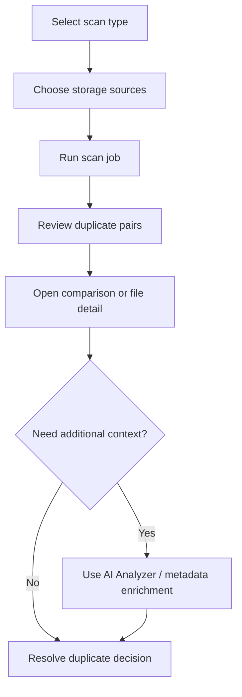

# AstraDup: Cross-Storage AI Deduplication Tracker

AstraDup is a React + TypeScript application for discovering and reviewing duplicate **videos**, **images**, and **documents** across multiple storage locations. The project currently focuses on a polished front-end workflow with a mock scanning API and real Gemini-powered analysis helpers, making it a strong base for teams that want to prototype or extend an AI-assisted dedup pipeline.

---

## Table of Contents

- [Overview](#overview)
- [Who AstraDup Is For](#who-astradup-is-for)
- [How It Works (High-Level Workflow)](#how-it-works-high-level-workflow)
- [Key Capabilities](#key-capabilities)
- [Architecture at a Glance](#architecture-at-a-glance)
- [System Requirements](#system-requirements)
- [Installation](#installation)
- [Running the App](#running-the-app)
- [Configuration Reference](#configuration-reference)
  - [Environment Variables](#environment-variables)
  - [Settings Persistence](#settings-persistence)
  - [Configuration Categories (Expanded)](#configuration-categories-expanded)
- [Feature Guide](#feature-guide)
  - [Dashboard](#dashboard)
  - [Duplicate Scan](#duplicate-scan)
  - [Comparison View](#comparison-view)
  - [File Detail View](#file-detail-view)
  - [AI Analyzer](#ai-analyzer)
  - [Settings](#settings)
- [Generated Output & Data Flow](#generated-output--data-flow)
- [Operational Runbook](#operational-runbook)
- [Security & Privacy Considerations](#security--privacy-considerations)
- [Project Structure](#project-structure)
- [Technology Stack](#technology-stack)
- [Known Limitations](#known-limitations)
- [Troubleshooting](#troubleshooting)
- [Best Practices](#best-practices)
- [Extending AstraDup](#extending-astradup)
- [License](#license)
- [Contributing](#contributing)

---

## Overview

Traditional duplicate detection based on filename and exact hash matching breaks down when files are:

- renamed (`IMG_1234.mov` vs `vacation_beach.mp4`),
- transcoded (`H.264` vs `H.265`),
- resized or compressed,
- exported into different formats,
- copied across unrelated storage systems.

AstraDup models a more realistic review process by combining:

1. **Scan type context** (video/image/document),
2. **Cross-source selection** (local, NAS, and cloud-like sources),
3. **Similarity-driven duplicate candidates**,
4. **Human-in-the-loop comparison before deletion**,
5. **AI-powered metadata and content analysis**.

The app ships with a mock backend layer so product, UX, and integration teams can validate workflows before connecting to production storage APIs.

## Who AstraDup Is For

AstraDup is useful for:

- media operations teams consolidating archives,
- IT/storage administrators reducing multi-platform duplication,
- product teams prototyping dedup workflows,
- developers building custom dedup backends with a ready front-end shell.

## How It Works (High-Level Workflow)

1. **Select a scan type**: video, image, or document.
2. **Select and connect storage sources**: local is available by default; cloud-like providers can be “connected” through simulated flows.
3. **Run scan**: the app displays progress and estimated remaining time.
4. **Review duplicates**: inspect pair-level similarity scores and matched modalities.
5. **Open comparison/detail pages**: review metadata and pick the canonical copy.
6. **Optionally enrich/analyze with AI**: use Gemini features for image/video/web analysis and metadata assistance.

---

## Key Capabilities

- **Multi-type dedup workflow** for videos, images, and documents.
- **Cross-storage source selection** with connection simulation for cloud providers.
- **Duplicate pair scoring** with modality signals (e.g., pHash, dHash, text hash, audio).
- **Side-by-side comparison tools** to reduce risky deletion decisions.
- **AI Analyzer workspace** for image prompts, video frame analysis, and grounded web queries.
- **Video metadata enrichment flow** for title/plot/genre/actors and reference source links.
- **Persistent settings** (database selection and custom sources) in browser local storage.

## Architecture at a Glance

AstraDup is currently a client-side application with two service layers:

- `services/api.ts` → **mocked data + simulated async scanning**
- `services/gemini.ts` → **Gemini SDK integration for AI actions**

This separation makes it straightforward to swap the mocked data service with real APIs while keeping the UI intact.

---

## System Requirements

- **Node.js**: 18+ recommended
- **npm**: 9+ recommended
- **Browser**: Latest Chrome, Edge, Firefox, or Safari
- **Gemini API key**: Required for AI features

> The app UI can run without an API key, but Gemini-dependent actions will fail until configured.

## Installation

1. **Clone the repository**

   ```bash
   git clone https://github.com/samueljackson-collab/AstraDup-Cross-Storage-Video-Files-duplication-tracker.git astra-dup
   cd astra-dup
   ```

2. **Install dependencies**

   ```bash
   npm install
   ```

3. **Create environment file**

   ```bash
   # .env.local
   API_KEY=your_gemini_api_key_here
   ```

4. **Start development server**

   ```bash
   npm run dev
   ```

5. **Open the app**

   Vite prints a local URL (typically `http://localhost:5173`).

## Running the App

### Development

```bash
npm run dev
```

### Production build

```bash
npm run build
```

### Preview production output

```bash
npm run preview
```

---

## Configuration Reference

### Environment Variables

| Variable | Required | Purpose |
|---|---:|---|
| `API_KEY` | Yes (for AI features) | API key used by `@google/genai` in `services/gemini.ts` |

If `API_KEY` is missing, all Gemini calls (image/video/web analysis and related AI features) will fail at runtime.

### Settings Persistence

User settings are stored in local storage under:

- `astradup_settings`

Current persisted settings include enabled/default/custom metadata databases configured in the Settings page.

### Configuration Categories (Expanded)

#### 1) Scan Types

| Scan Type | Primary Goal | Typical Similarity Signals | Example Conflict Scenario |
|---|---|---|---|
| Video | Detect same visual/auditory content across re-encodes and renames | pHash, dHash, scene embeddings, audio fingerprint, face clusters | 1080p H.264 local copy vs 720p H.265 NAS backup |
| Image | Identify visually similar photos across RAW/JPEG exports | pHash, dHash, EXIF timestamp, object tags | DSLR RAW file in cloud + compressed JPEG on local |
| Document | Surface near-identical text artifacts across revisions | text hash, keyword density, content similarity | `proposal_v1.2.docx` vs `proposal_final.pdf` |

#### 2) Storage Sources

| Source | Current Demo Behavior | Real-world Integration Notes |
|---|---|---|
| Local Drive | Available immediately | Replace with indexed filesystem walker + permission checks |
| NAS | Selectable in source workflow | Add SMB/NFS connector with retry + partial-scan recovery |
| Google Drive | Simulated cloud connect flow | Add OAuth, incremental scan cursors, and rate-limit handling |
| Dropbox | Simulated cloud connect flow | Add delta sync polling and conflict-aware metadata writes |
| OneDrive | Simulated cloud connect flow | Add Graph API integration with tenant-aware auth controls |

#### 3) AI Analysis Tools

| Tool | Input Type | Output Type | Typical Usage |
|---|---|---|---|
| Image Analysis | Single image + prompt | Textual explanation / object-level interpretation | Ask “Are these two shots the same scene?” |
| Video Analysis | Extracted frames + prompt | Temporal summary / candidate tags | Summarize content before deciding canonical copy |
| Web Analysis | Text query | Grounded answer from web tools | Discover metadata source recommendations |

#### 4) Comparison & Resolution Controls

- **Similarity score** gives a quick confidence baseline, but should not be used alone.
- **Matched modalities** indicate *why* the pair was flagged (e.g., visual + audio agreement).
- **Metadata context** (duration, resolution, codec, size) helps determine the highest-value file to keep.
- **Resolution policy suggestion** (recommended for production):
  - keep highest quality,
  - preserve richest metadata,
  - quarantine before hard delete,
  - record audit event with actor + timestamp.

#### 5) Settings Surface

| Setting Area | User Action | Why It Matters |
|---|---|---|
| Metadata databases | Enable/disable built-ins | Controls enrichment source trust and relevance |
| Custom DB entries | Add name + URL | Supports internal/private catalogs |
| Verification | Simulated “verify” action | In production, should validate auth + API response health |
| Save/Reset | Persist or restore defaults | Ensures reproducible team configuration states |

---

## Feature Guide

### Dashboard

The dashboard summarizes the current mock environment:

- files scanned,
- duplicates found per media type,
- estimated storage savings,
- distribution charts/stat blocks.

Use it as a high-level triage surface before starting targeted scans.

### Duplicate Scan

The scan flow is broken into distinct phases:

1. **Type selection** (`video`, `image`, `document`)
2. **Source selection** (toggle and connect storage sources)
3. **Scanning** (progress + estimated remaining time)
4. **Completion** (duplicate pairs and summary metrics)

The current scan backend is mocked with deliberate delays to simulate realistic UI state changes.

### Comparison View

Comparison focuses on confident resolution of duplicate candidates:

- side-by-side file metadata,
- similarity score,
- matched modalities,
- keep/delete-style interaction safeguards.

Important: deletion-style actions are UI-level in the current demo build and do not remove real files.

### File Detail View

The file detail page exposes deep metadata for a selected file and shows related duplicate candidates, helping users audit each decision path.

### AI Analyzer

Analyzer includes three dedicated tools:

- **Image Analysis**: prompt + image input for descriptive or QA-style outputs.
- **Video Analysis**: extracts representative frames and sends multimodal prompts.
- **Web Analysis**: grounded query mode using Google Search tool integration.

### Settings

Settings provides:

- default entertainment metadata source toggles,
- custom database entry (name + URL),
- simulated verification,
- AI-assisted database discovery suggestions,
- reset-to-default and save confirmation flow.

---

## Generated Output & Data Flow

### Data Sources in the current app

- **Mock files and duplicate pairs** are defined in `services/api.ts`.
- **Scan results** are generated from mock duplicate sets filtered by media type.
- **Dashboard metrics** are simulated and returned asynchronously.
- **Metadata enrichment** is mocked for video files.

### AI request path

1. User triggers AI action from Analyzer/Settings.
2. Request goes through `services/gemini.ts`.
3. Gemini model returns response.
4. UI renders parsed output/errors.

### Routing behavior

The app uses **HashRouter**, so direct URLs include hash segments (for example `/#/scan`). This is useful for static hosting where server-side route fallback is unavailable.

### End-to-end flow diagram



---

## Operational Runbook

### Recommended review sequence per duplicate pair

1. Confirm file type and source locations.
2. Compare dimensions/duration/page count and encoding clues.
3. Check matched modalities and similarity score.
4. Inspect enrichment metadata quality.
5. Decide canonical artifact and mark non-canonical copy for archive/delete policy.

### Suggested team roles (for production deployments)

| Role | Responsibility |
|---|---|
| Storage Operator | Executes scheduled scans, monitors failures |
| Content Reviewer | Validates duplicate decisions and metadata quality |
| Platform Engineer | Maintains connectors, queues, and API reliability |
| Auditor/Compliance | Reviews deletion logs and retention conformance |

### Incident response checklist

- Pause destructive actions if confidence anomalies spike.
- Re-run scan in read-only mode to validate candidate consistency.
- Export decision set for peer review.
- Roll back from quarantine snapshot if incorrect deletions occurred.

## Security & Privacy Considerations

- **Principle of least privilege**: cloud integrations should request minimal scopes.
- **Data minimization**: only send required snippets/frames to AI services.
- **Retention policy**: define TTL for cached analysis and scan artifacts.
- **PII handling**: redact sensitive filenames/content before external AI calls where required.
- **Auditability**: log who approved each destructive action and why.

For enterprise deployments, consider adding KMS-backed secret management, tenant segmentation, and immutable audit logs.

---

## Project Structure

```text
astra-dup/
├── App.tsx                    # Route declarations (HashRouter)
├── index.tsx                  # App bootstrap
├── index.html                 # Vite HTML entry
├── metadata.json              # Project metadata
├── pages/
│   ├── Dashboard.tsx          # Overview and key metrics
│   ├── ScanPage.tsx           # Scan type/source/progress/results flow
│   ├── ComparisonPage.tsx     # Side-by-side duplicate comparison
│   ├── AnalyzerPage.tsx       # Gemini-powered analyzer tools
│   ├── Settings.tsx           # Database configuration + persistence
│   └── FileDetail.tsx         # File-level detail and related duplicates
├── components/                # Shared UI building blocks
├── services/
│   ├── api.ts                 # Mock API layer and sample data
│   └── gemini.ts              # Gemini client wrapper and helpers
├── types.ts                   # Shared TypeScript models
└── vite.config.ts             # Vite configuration
```

## Technology Stack

| Technology | Version (from `package.json`) | Purpose |
|---|---|---|
| React | 19.2.4 | Component-based UI |
| React DOM | 19.2.4 | Browser rendering |
| React Router DOM | 7.13.0 | Client-side routing |
| TypeScript | ~5.8.2 | Static typing |
| Vite | ^6.2.0 | Dev server + build pipeline |
| `@google/genai` | 0.14.0 | Gemini SDK integration |

---

## Known Limitations

- No real storage connectors yet (source connections are simulated).
- Scans are mock-driven; no filesystem/NAS/cloud crawling in current implementation.
- Duplicate candidates are predefined examples, not generated from actual user files.
- “Delete” operations are demonstrative and non-destructive.
- Settings validation/verification is simulated and not network-backed.

## Troubleshooting

### 1) AI features fail immediately

**Symptoms**
- Analyzer calls fail or return configuration errors.

**Checks**
- Confirm `.env.local` contains `API_KEY=...`.
- Restart dev server after editing env files.
- Verify the key has access to requested Gemini models.

### 2) Source connection appears stuck

**Symptoms**
- Cloud source shows connecting state.

**Checks**
- Wait for simulated async connection to finish.
- Refresh the page to reset transient UI state.

### 3) No meaningful scan variation

**Explanation**
- Current results are deterministic mock outputs by selected scan type.

**Next step**
- Replace `services/api.ts` functions (`startScan`, `getFileDetails`, etc.) with real backend endpoints.

### 4) Routing issues on static hosting

**Explanation**
- HashRouter requires URLs with `/#/` segments.

**Fix**
- Ensure links preserve hash paths, e.g., `https://host/#/scan`.

---

## Best Practices

- **Review before removal**: never bulk-delete solely from score values.
- **Prioritize canonical quality**: keep highest fidelity version (resolution/bitrate/metadata completeness).
- **Enable traceability**: log who resolved duplicates and why (when adding backend).
- **Start with one source class**: validate settings and thresholds before full cross-source runs.
- **Design rollback paths**: implement soft-delete/quarantine in production integrations.

## Extending AstraDup

If you plan to productionize AstraDup, a practical implementation roadmap is:

1. Replace mock service methods in `services/api.ts` with real API adapters.
2. Add job orchestration for long-running scans (queue + status polling/websockets).
3. Introduce persistence for scan history, decisions, and audit trails.
4. Add auth/roles for reviewer workflows.
5. Add bulk actions and policy-driven resolution rules.
6. Add test coverage for service adapters and critical decision UI paths.

---

## License

This project is provided as-is for deduplication and storage management workflows.

## Contributing

Contributions are welcome. Please keep code comments and documentation aligned with workflow, architecture, and API behavior changes.
