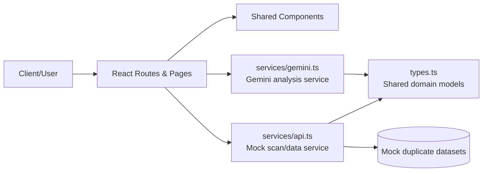
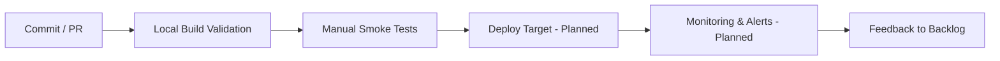

# AstraDup: Cross-Storage AI Deduplication Tracker

> **Status key:** 🟢 Done · 🟠 In Progress · 🔵 Planned · 🔄 Recovery/Rebuild · 📝 Documentation Pending

---

## 1) 🎯 Project Overview

AstraDup is a React + TypeScript application for discovering and reviewing duplicate **videos**, **images**, and **documents** across multiple storage locations. It is designed for media operations teams, storage administrators, and product/engineering teams that need realistic deduplication workflows before production connectors are fully implemented. Traditional duplicate detection based only on exact hash or filename matching fails when files are renamed, transcoded, compressed, resized, or exported to different formats. AstraDup focuses on similarity-oriented candidate discovery, human-in-the-loop review, and AI-assisted context gathering so teams can make safer canonicalization decisions. The current implementation combines polished front-end workflows, a mocked scan/data layer, and Gemini-powered analysis helpers to support UX prototyping and architecture validation. Success is measured by lower duplicate storage overhead, higher decision confidence, reduced accidental deletion risk, and clear operational pathways for future productionization.

### Outcomes
- Standardized duplicate review workflow across video, image, and document contexts.
- Faster triage through scan progress simulation, pair scoring, and side-by-side comparison.
- Better confidence with matched modality signals and metadata-aware review steps.
- AI-assisted enrichment path for content interpretation and metadata augmentation.
- Extensible service boundaries so mock layers can be replaced with real APIs/connectors.
- Documentation-first operating model that improves onboarding and planning transparency.

### Who AstraDup Is For
- Media archive teams consolidating scattered content libraries.
- IT and storage operators handling cross-platform duplication drift.
- Product teams prototyping dedup UX and governance processes.
- Engineers integrating future storage connectors and policy engines.
- Stakeholders evaluating readiness, risks, and roadmap maturity.

### Problem Context
Traditional dedup fails in common real-world scenarios:
- Filename changes (`vacation_clip_final.mp4` vs `IMG_4012.MOV`).
- Codec shifts (H.264 vs H.265) for same visual source.
- Resolution changes (4K master vs 1080p derivative).
- Container conversion (`.mov` to `.mp4`).
- AI-generated subtitles or metadata variations.
- Cloud sync duplication across user/team drives.

### Business and Technical Value Signals
- Lower storage costs from better duplicate candidate surfacing.
- Safer cleanup decisions through review-first workflows.
- Better governance posture via traceable decision pathways.
- Faster implementation cycles due to service abstraction and mock-first architecture.
- Reduced adoption friction through explicit runbooks and troubleshooting guidance.

---

## 2) 📌 Scope and Status

| Area | Status | Notes | Next Milestone |
|---|---|---|---|
| Core scan and review UX (`Dashboard`, `Scan`, `Comparison`, `Detail`) | 🟢 Done | End-to-end front-end flow is implemented with mock data and staged scan states. | Replace mock scan endpoints with real connector contract. |
| AI analysis tooling (`Analyzer`, metadata assistance) | 🟠 In Progress | Gemini integration is implemented; resiliency and telemetry are still lightweight. | Add richer error taxonomy + observability hooks. |
| Settings and source configuration UX | 🟢 Done | Settings persistence and source-selection workflows are available. | Add production-backed verification endpoints. |
| Testing and delivery automation | 🔵 Planned | Build verification exists; automated unit/integration/e2e suites are not committed. | Introduce baseline test stack and CI gating workflow. |
| Security hardening and governance controls | 🔵 Planned | Risks and controls are documented, but many controls are process-level only. | Implement auth, audit logs, role policies, and key management. |
| Production observability and reliability SLOs | 🔵 Planned | Delivery and observability model is defined conceptually. | Add metrics, alerts, and SLO dashboards. |

> **Scope note:** Current scope emphasizes front-end workflow validation, mock scan orchestration, and AI helper integration. Explicitly deferred for now: real storage crawling, destructive deletion execution, enterprise IAM/role enforcement, and complete production monitoring.

### Current Phase
- **Phase:** Front-end validation and architecture stabilization.
- **Confidence:** Medium-high for UX/workflow; medium-low for production operations.
- **Readiness summary:** Good for prototype/demo and integration design; not yet production-ready.

### In-Scope Workstreams (Detailed)
- UI route composition and state transitions.
- Duplicate pair exploration and comparison affordances.
- File-level metadata inspection workflows.
- AI analysis utility flows for media/context support.
- Settings persistence and source selection simulation.

### Out-of-Scope Workstreams (Current Iteration)
- Real connector auth/token refresh logic.
- Long-running distributed scan orchestration infrastructure.
- Permanent scan history persistence.
- Automated remediation/deletion against real storage systems.
- Full compliance reporting and legal hold policy support.

### Next Major Milestone
- Integrate a first real backend contract for scan initiation + status polling while preserving current UI behaviors.

---

## 3) 🏗️ Architecture

AstraDup is a Vite + React SPA that uses `HashRouter` and route-level pages for dashboard, scan, comparison, file detail, analyzer, and settings experiences. Page logic delegates to service abstractions: `services/api.ts` simulates scanning/data retrieval and `services/gemini.ts` handles AI requests. Shared type definitions in `types.ts` provide a consistent domain model across pages/components/services. This architecture intentionally preserves clean replacement seams for production APIs while enabling rapid UX iteration in a mock-first environment.



| Component | Responsibility | Key Interfaces |
|---|---|---|
| `pages/` | Route-level orchestration for dashboard, scan, comparison, detail, analyzer, settings. | Route mapping in `App.tsx`, state/event handlers, effect lifecycles. |
| `components/` | Reusable UI controls and display modules. | Prop contracts and callback patterns consumed by pages. |
| `services/api.ts` | Mock scan lifecycle, duplicate sets, metrics, and details retrieval. | Async methods called from scan/dashboard/detail workflows. |
| `services/gemini.ts` | AI request wrappers for image/video/web tasks and metadata assistance. | `API_KEY`-backed client helpers with error propagation to UI. |
| `types.ts` | Shared type definitions for file entities and scan/result shapes. | Type imports used across pages, services, and components. |

### Core Boundaries
- **UI Boundary:** all user interactions originate in routes/components.
- **Data Boundary:** mock API layer provides deterministic async behavior.
- **AI Boundary:** Gemini integration is isolated to one service module.
- **Type Boundary:** shared model definitions minimize schema drift.

### End-to-End Data and Control Flow
1. User selects scan type/sources from `ScanPage`.
2. Page calls mock scan initiation helper in `services/api.ts`.
3. UI polls/simulates status changes and updates progress indicators.
4. Duplicate candidates are rendered with score + modality context.
5. User opens comparison/detail pages for pair-level decisions.
6. Optional AI analysis call routes through `services/gemini.ts`.
7. Analyzer/settings pages surface AI output and error states.

### Route and UX Surface Map
- `/#/` → Dashboard overview and aggregate metrics.
- `/#/scan` → Scan setup, source selection, progress, and result list.
- `/#/comparison/:id` → Side-by-side pair inspection.
- `/#/file/:id` → Single-file detail + related duplicate context.
- `/#/analyzer` → AI tool workspace for image/video/web analysis.
- `/#/settings` → Database/source preferences and persistence controls.

### Project Structure
```text
astra-dup/
├── App.tsx
├── index.tsx
├── index.html
├── metadata.json
├── pages/
│   ├── Dashboard.tsx
│   ├── ScanPage.tsx
│   ├── ComparisonPage.tsx
│   ├── AnalyzerPage.tsx
│   ├── Settings.tsx
│   ├── FileDetail.tsx
│   └── VideoDetail.tsx
├── components/
│   ├── Button.tsx
│   ├── Layout.tsx
│   ├── Spinner.tsx
│   ├── StorageSelector.tsx
│   ├── DuplicateResultDisplay.tsx
│   ├── DetailViews.tsx
│   ├── FilePreview.tsx
│   ├── ErrorBoundary.tsx
│   ├── FileTypeIcons.tsx
│   └── Icons.tsx
├── services/
│   ├── api.ts
│   └── gemini.ts
├── utils/
│   └── video.ts
├── types.ts
├── package.json
├── tsconfig.json
└── vite.config.ts
```

### Technology Stack
| Technology | Version | Purpose |
|---|---|---|
| React | 19.2.4 | UI composition and stateful workflows |
| React DOM | 19.2.4 | Browser rendering runtime |
| React Router DOM | 7.13.0 | Client-side route management |
| TypeScript | ~5.8.2 | Static typing and safer model evolution |
| Vite | ^6.2.0 | Dev server and production bundling |
| `@google/genai` | 0.14.0 | Gemini API client integration |

### Architecture Decisions (ADR-Style Summary)
| Decision | Why | Tradeoff |
|---|---|---|
| Mock-first service boundary | Enables rapid UX iteration with realistic async flows | Risk of drift vs production backend behavior |
| HashRouter | Supports static hosting without server route fallback | Less clean URLs than browser history mode |
| Centralized Gemini wrapper | Keeps AI integration concerns isolated | Requires robust error mapping for UX clarity |
| Shared `types.ts` model | Reduces schema inconsistency across layers | Needs disciplined updates with backend contract changes |

### Future Architecture Evolutions
- Connector adapter layer per storage provider.
- Job queue abstraction for long-running scans.
- Persistent scan history store and decision audit model.
- Feature-flagged policy engine for resolution automation.
- Telemetry envelope for all scan and AI actions.

---

## 4) 🚀 Setup and Runbook

### Prerequisites
- Node.js 18+ and npm 9+.
- `.env.local` with `API_KEY=<your_gemini_api_key>` for AI features.
- Browser: latest Chrome/Edge/Firefox/Safari.
- Optional: stable network connectivity for Gemini-powered actions.

### Installation and Runtime Commands
| Step | Command | Expected Result |
|---|---|---|
| Install dependencies | `npm install` | Packages install; `node_modules/` appears. |
| Dev run | `npm run dev` | Vite serves app (default `http://localhost:5173`). |
| Production build | `npm run build` | `dist/` output is generated. |
| Production preview | `npm run preview` | Built artifacts are served for manual QA. |

### Environment Variables
| Variable | Required | Description |
|---|---:|---|
| `API_KEY` | Yes for AI features | Gemini API key consumed by `services/gemini.ts`. |

### Settings Persistence
- Local storage key: `astradup_settings`.
- Stores metadata database preferences and custom source entries.
- Persists between browser sessions for repeatable local behavior.

### Configuration Categories (Expanded)

#### 4.1 Scan Types
| Scan Type | Primary Goal | Typical Signals | Example Scenario |
|---|---|---|---|
| Video | Find same content across encode/container variance | pHash, dHash, scene embeddings, audio fingerprint | 1080p H.264 local file vs 720p H.265 NAS copy |
| Image | Match visually similar assets across export variants | pHash, dHash, EXIF timing, object tags | RAW source in cloud vs compressed JPG locally |
| Document | Detect near-identical text across versions | text hash, keyword density, semantic similarity | `proposal_v1.2.docx` vs `proposal_final.pdf` |

#### 4.2 Storage Sources
| Source | Current Demo Behavior | Production Integration Notes |
|---|---|---|
| Local Drive | Immediately selectable | Add indexed walker + permission checks |
| NAS | Selectable in source flow | Add SMB/NFS connector + retry + resume |
| Google Drive | Simulated connection UX | Add OAuth, cursor sync, quota handling |
| Dropbox | Simulated connection UX | Add delta sync and conflict-safe metadata writes |
| OneDrive | Simulated connection UX | Add Graph API integration with tenant-aware auth |

#### 4.3 AI Analysis Tools
| Tool | Input | Output | Typical Use |
|---|---|---|---|
| Image Analysis | Image + prompt | Text explanation and interpretation | Verify scene/object similarity |
| Video Analysis | Sample frames + prompt | Temporal summary and tags | Decide canonical video candidate |
| Web Analysis | Query text | Grounded response | Discover metadata source references |

#### 4.4 Comparison and Resolution Controls
- Similarity score is directional confidence, not a deletion mandate.
- Matched modalities explain candidate linkage rationale.
- Metadata (duration, codec, size, resolution) informs canonical preference.
- Recommended production policy:
  - keep highest quality version,
  - preserve richest metadata variant,
  - quarantine before hard deletion,
  - log decision actor + timestamp + reason.

#### 4.5 Settings Surface
| Setting Area | User Action | Why It Matters |
|---|---|---|
| Metadata DB toggles | Enable/disable source databases | Controls enrichment trust surface |
| Custom source entry | Add name + URL | Supports private/internal catalogs |
| Verification action | Simulated check | Placeholder for real auth/health validation |
| Save/Reset | Persist or restore defaults | Ensures consistent team baseline |

### Feature Runbook (Operational Usage)

#### Dashboard
- Use for quick health snapshot: scanned file count, duplicate counts, and estimated savings.
- Validate that summary metrics align with scan-type expectations.

#### Scan Page
- Choose media type and source set.
- Trigger scan and monitor progress/ETA.
- Review returned candidate pairs and summary totals.

#### Comparison Page
- Open pair-level view for detailed side-by-side checks.
- Validate modality evidence and metadata differences.
- Record intended canonicalization decision logic.

#### File Detail Page
- Inspect single file metadata in depth.
- Cross-check linked duplicates and provenance hints.

#### Analyzer Page
- Run image/video/web AI tools for supporting context.
- Treat AI outputs as advisory; verify with metadata evidence.

#### Settings Page
- Configure metadata source preferences.
- Persist reusable environment settings.
- Reset when troubleshooting inconsistent local state.

### Troubleshooting (Top 3 + Expanded)
| Issue | Likely Cause | Resolution |
|---|---|---|
| AI calls fail | Missing/invalid `API_KEY` or model access restriction | Set `.env.local` key, restart app, validate account/model access |
| Source connection appears stuck | Simulated delay/state desync in mock flow | Wait briefly, refresh page, re-run source selection |
| Scan output seems repetitive | Deterministic mock datasets by scan type | Replace `services/api.ts` with dynamic backend endpoints |

#### Additional Troubleshooting Notes
- If route loading behaves unexpectedly on static hosting, ensure URLs include `/#/` path segments.
- If settings do not persist, check browser local-storage access policies.
- If analyzer output is delayed, inspect console/network for failed API requests.

### Recovery and Incident Handling Runbook

#### Suggested Review Sequence per Candidate
1. Confirm type and source provenance.
2. Compare codec/resolution/size/duration (or equivalent for non-video).
3. Review modality matches + score confidence.
4. Cross-check metadata enrichment quality.
5. Select canonical artifact; stage non-canonical as quarantine/delete candidate.

#### Suggested Team Responsibilities
| Role | Responsibility |
|---|---|
| Storage Operator | Executes scans and watches failure states |
| Content Reviewer | Performs candidate validation and decision checks |
| Platform Engineer | Maintains connectors, queues, and service reliability |
| Auditor/Compliance | Reviews retention and deletion evidence trails |

#### Incident Checklist
- Pause destructive actions when anomaly rate increases.
- Re-run affected scan in read-only mode.
- Export decision sets for peer review.
- Restore from quarantine snapshots when needed.

---

## 5) ✅ Testing and Quality Evidence

Current quality confidence is based on build validation and manual route/workflow checks. Automated unit, integration, and e2e suites are planned but not yet committed in this repository. As a result, quality gates today rely on successful build output, smoke-testing critical routes, and verifying expected behavior in mock scan + AI analysis pathways.

| Test Type | Command / Location | Current Result | Evidence Link |
|---|---|---|---|
| Build/Compile | `npm run build` | environment-dependent | `package.json` build script + `dist/` artifact target |
| Unit | Not implemented | n/a | Planned test layer |
| Integration | Not implemented | n/a | Planned service/UI integration checks |
| E2E/Manual | `npm run dev` then route smoke flow | partial/manual | `pages/ScanPage.tsx`, `pages/ComparisonPage.tsx`, `pages/FileDetail.tsx`, `pages/AnalyzerPage.tsx`, `pages/Settings.tsx` |

### Manual Test Matrix (Current Practice)
| Workflow | Steps | Expected Behavior | Status |
|---|---|---|---|
| Dashboard load | Open root route | Stats and overview cards render without crash | 🟢 Done |
| Scan flow | Select type + sources, start scan | Progress UI transitions and results list appear | 🟢 Done |
| Compare flow | Open candidate pair | Side-by-side metadata and score context visible | 🟢 Done |
| File detail flow | Open file detail from list | File metadata and related candidate links render | 🟢 Done |
| Analyzer image flow | Submit image prompt | AI response or explicit error message is shown | 🟠 In Progress |
| Settings persistence | Update and save settings | Data persists to local storage key | 🟢 Done |

### Known Gaps
- No committed test runner (`vitest`, `jest`, `playwright`, etc.).
- No CI workflow enforcing build/test gates.
- No automated regression suite for scan state transitions.
- No contract tests for future backend APIs.
- Limited synthetic checks for AI failure modes and retries.

### Quality Improvement Backlog
- Add unit tests for core rendering and helper utilities.
- Add integration tests around mock service interactions.
- Add e2e smoke tests for scan/comparison/analysis.
- Add static checks (linting/format/TS strictness guardrails).
- Add PR quality gate requiring build + test pass.

---

## 6) 🔐 Security, Risk, and Reliability

| Risk | Impact | Current Control | Residual Risk |
|---|---|---|---|
| API key mishandling in local setups | High | Env-based key injection; no hardcoded secret in source | Medium |
| False positive resolution causing deletion mistakes | High | Human review-first comparison/detail workflow | Medium |
| AI service outage/quota/latency | Medium | AI is optional; non-AI flows remain usable | Medium |
| Missing production auth/role boundaries | High | Deferred scope; documented future control plan | High |
| Limited operational telemetry | Medium | Manual troubleshooting + planned monitoring rollout | Medium-High |
| Connector auth complexity when productionized | Medium | Deferred with explicit roadmap and runbook placeholders | Medium |

### Reliability Controls
- Human-in-the-loop decision sequence before destructive action.
- Service-layer abstraction allowing controlled backend replacement.
- Runbook-driven incident steps and recovery expectations.
- Planned quarantine-first rollback strategy.
- Settings persistence for reproducible local behavior.

### Additional Security Controls (Planned)
- KMS-backed secret storage for server-side keys.
- Fine-grained OAuth scopes per storage connector.
- Tenant-aware isolation for enterprise environments.
- Immutable decision/audit logs.
- Policy-based redaction before external AI calls.

### Recovery and Rollback Strategy
1. Stage non-canonical files in quarantine.
2. Maintain reversible action ledger.
3. Snapshot before permanent deletion.
4. Restore via snapshot on misclassification events.
5. Run post-incident analysis and adjust thresholds/policies.

### Risk Ownership Model (Suggested)
| Control Domain | Owner | Escalation Path |
|---|---|---|
| Access and secrets | Platform Engineer | Security Lead |
| Decision quality | Content Reviewer Lead | Product Owner |
| Data retention policy | Compliance Owner | Legal/InfoSec |
| Runtime reliability | SRE/Platform | Engineering Manager |

---

## 7) 🔄 Delivery, CI/CD, and Observability



| Signal | Source | Threshold/Expectation | Owner |
|---|---|---|---|
| Build success | Local `npm run build` | Must pass prior to merge | Maintainer |
| Runtime error count | Browser console/manual checks | No uncaught errors in critical routes | Maintainer |
| AI request success ratio | Analyzer/settings usage | Graceful failures + clear user feedback | Maintainer |
| Availability | Planned platform monitors | SLO target TBD before production | TBD |
| Latency | Planned APM + frontend timing | Target TBD per route/API | TBD |

### Current Delivery Reality
- No committed CI workflow files in repository.
- Deployment mechanics are environment-specific and not codified.
- Manual validation remains the primary pre-merge quality mechanism.

### Planned CI/CD Layers
1. **Stage 1:** Build-only CI gate.
2. **Stage 2:** Unit/integration test gate.
3. **Stage 3:** E2E smoke gate.
4. **Stage 4:** Artifact publication + deploy automation.
5. **Stage 5:** Post-deploy health checks and rollback triggers.

### Observability Plan
- Centralized logs for scan actions and AI requests.
- Basic metrics for route errors and scan completion timing.
- Alerting for repeated AI/auth failures.
- Health dashboard for availability/latency/error trends.
- Service-level objective definitions once deployment platform is finalized.

### Service Health Indicators (Draft)
| Indicator | Description | Proposed Target |
|---|---|---|
| Scan flow completion rate | Percentage of scans reaching completion UI state | > 99% in stable environment |
| Analyzer success visibility | Fraction of AI failures with user-readable reason | 100% |
| UI crash-free sessions | Sessions without unhandled runtime exceptions | > 99.5% |
| Settings persistence success | Save operations reflected on reload | 100% local |

---

## 8) 🗺️ Roadmap and Milestones

| Milestone | Status | Target | Owner | Dependency/Blocker |
|---|---|---|---|---|
| Add unit + integration test baseline | 🟠 In Progress | Next sprint | Maintainer | Framework decision + fixtures |
| Add CI pipeline for build/test gates | 🔵 Planned | Following sprint | Maintainer | Test baseline availability |
| Implement first real scan API contract | 🔵 Planned | Q2 2026 | Maintainer | Backend contract definition |
| Introduce persistent scan history + decision ledger | 🔵 Planned | Q2 2026 | Maintainer | Data model and storage choice |
| Add role-based review and approval model | 🔵 Planned | Q3 2026 | Maintainer | Auth provider and policy design |
| Add observability dashboard + alerts | 🔵 Planned | Q3 2026 | Maintainer | Deployment platform + telemetry stack |
| Add connector adapters (Drive/Dropbox/OneDrive/NAS) | 🔵 Planned | Q4 2026 | Maintainer | OAuth scopes + connector SDK choices |

### Recently Completed
- Route-level UX for scan/comparison/detail/analyzer/settings.
- Mock service boundaries for scan and candidate retrieval.
- Documentation migration to portfolio structure with status transparency.

### Near-Term Priorities
- Stabilize testable service interfaces.
- Add baseline automated quality gates.
- Improve error surfacing and reliability semantics in AI flows.

### Mid-Term Priorities
- Back-end contract implementation.
- Connector auth and resilience.
- Operational controls and compliance evidence.

### Dependencies and Blockers
- Availability of backend API contract definitions.
- Storage provider auth/security decisions.
- CI platform setup and permissions.
- Team bandwidth for test infrastructure and observability.

---

## 9) 📎 Evidence Index

- [Route composition and app shell](./App.tsx)
- [Application bootstrap](./index.tsx)
- [Scan workflow page](./pages/ScanPage.tsx)
- [Comparison workflow page](./pages/ComparisonPage.tsx)
- [File detail workflow page](./pages/FileDetail.tsx)
- [Video detail page](./pages/VideoDetail.tsx)
- [Analyzer workflow page](./pages/AnalyzerPage.tsx)
- [Settings page (persistence/config)](./pages/Settings.tsx)
- [Dashboard page](./pages/Dashboard.tsx)
- [Mock data and scan service](./services/api.ts)
- [Gemini integration service](./services/gemini.ts)
- [Shared domain model types](./types.ts)
- [Video utility helpers](./utils/video.ts)
- [Duplicate result display component](./components/DuplicateResultDisplay.tsx)
- [Storage selector component](./components/StorageSelector.tsx)
- [Project scripts and dependency manifest](./package.json)
- [Build configuration](./vite.config.ts)
- [TypeScript config](./tsconfig.json)
- [Project metadata](./metadata.json)

### Evidence Usage Guidance
- Use page files for UX flow verification.
- Use service files for data and AI behavior assumptions.
- Use configuration files for runtime/build contract checks.
- Use component files to trace rendering and interaction details.

---

## 10) 🧾 Documentation Freshness

| Cadence | Action | Owner |
|---|---|---|
| Per major merge | Update scope/status table and roadmap deltas | Maintainer |
| Weekly | Validate setup commands and evidence links | Maintainer |
| Bi-weekly | Review known gaps vs current implementation | Maintainer |
| Monthly | README quality audit against portfolio standard | Maintainer |
| Quarterly | Architecture + risk section alignment review | Maintainer |

### Documentation Change Policy
- Keep historical project detail; avoid destructive document pruning.
- Prefer expansion and clarification over removal.
- Preserve template section ordering for consistency.
- Update evidence links whenever file paths change.
- Clearly mark planned vs implemented capabilities.

### README Ownership
| Role | Responsibility |
|---|---|
| Maintainer | Primary author and final approver |
| Contributors | Submit updates with feature changes |
| Reviewers | Ensure factual and status consistency |

---

## 11) ✅ Final Quality Checklist (Before Merge)

- [x] Status legend is present and used consistently.
- [x] All required template sections are present.
- [x] Architecture diagram renders in GitHub markdown preview.
- [x] Delivery diagram is included and consistent with current state.
- [x] Setup commands are documented and mapped to expected outputs.
- [x] Troubleshooting includes top failure cases and resolutions.
- [x] Testing table includes current evidence and known gaps.
- [x] Risk and reliability controls are documented.
- [x] Roadmap includes multiple planned milestones.
- [x] Evidence links point to repository files.
- [x] Documentation freshness cadence and owner are defined.
- [x] README reflects current implementation and deferred scope.

---

## Appendix A: Extended Feature Guide

### A.1 Dashboard Deep-Dive
- Displays aggregate counts for scanned assets and duplicate candidates.
- Highlights potential storage savings as an operational motivator.
- Provides a fast decision point on whether to run targeted scans.
- Can evolve into a true operational cockpit with historical trend lines.

### A.2 Scan Flow Deep-Dive
- Type selection influences candidate dataset and modality emphasis.
- Source selection simulates heterogeneous storage ecosystems.
- Progress and ETA states mimic asynchronous backend execution.
- Completion stage exposes candidate count and summary data.

### A.3 Comparison View Deep-Dive
- Side-by-side metadata supports nuanced quality assessment.
- Score + modality context reduces black-box perception.
- Workflow encourages intentional, review-driven canonicalization.
- Future extension: approval chains and annotation history.

### A.4 File Detail Deep-Dive
- Single artifact focus helps diagnose edge-case candidates.
- Related duplicates provide local graph-like context.
- Future extension: provenance timeline and ownership metadata.

### A.5 Analyzer Deep-Dive
- Supports image interpretation for context confirmation.
- Supports video frame-assisted summarization.
- Supports web-grounded lookup for metadata references.
- Future extension: structured output schema for policy engines.

### A.6 Settings Deep-Dive
- Enables reproducible local configuration.
- Supports custom metadata source listing.
- Simulated verification prepares UX for future live checks.
- Future extension: scoped credential testing and capability audits.

---

## Appendix B: Sample Operating Procedures

### B.1 Daily Operations (Prototype Environment)
1. Open dashboard and confirm expected baseline metrics.
2. Run one scan per media type to check flow health.
3. Sample at least three candidate pairs for quality sanity.
4. Validate settings persistence by save/reload cycle.
5. Record notable issues in backlog with route + state details.

### B.2 Weekly Quality Review
1. Re-run full manual smoke checklist.
2. Review AI failure messages for user clarity.
3. Validate all README evidence links.
4. Update roadmap statuses if milestones moved.
5. Log risks that changed impact or likelihood.

### B.3 Pre-Release Simulation Checklist
1. Build production bundle.
2. Preview and smoke all major routes.
3. Validate browser local storage behavior.
4. Verify route handling in static-host-like environment.
5. Confirm known gaps are documented and acknowledged.

---

## Appendix C: Candidate Evaluation Heuristics

### C.1 Video Heuristics
- Prefer higher resolution when bitrate and artifacts are acceptable.
- Prefer richer audio channels when visual quality is equivalent.
- Prefer files with better subtitle/metadata completeness.
- Favor stable codec/container formats aligned with playback ecosystem.

### C.2 Image Heuristics
- Prefer source with highest visual fidelity and least compression artifacts.
- Preserve original capture metadata when available.
- Retain source with consistent color profile for downstream workflows.

### C.3 Document Heuristics
- Prefer version with authoritative revision status.
- Compare embedded metadata (author/date/system) cautiously.
- Preserve accessible/searchable formats where policy permits.

### C.4 Tie-Breaker Rules (Suggested)
1. Quality score.
2. Metadata richness.
3. Provenance trust.
4. Organizational policy preference.
5. Reviewer override with reason code.

---

## Appendix D: Productionization Blueprint

### D.1 Connector Strategy
- Implement connector interface per provider.
- Normalize metadata into shared model.
- Track cursor/sync state for incremental scans.
- Handle throttling and transient errors gracefully.

### D.2 Scan Orchestration Strategy
- Queue scan jobs with retry/backoff semantics.
- Persist job state transitions.
- Offer polling and event-driven update channels.
- Capture job-level metrics for observability.

### D.3 Decision Workflow Strategy
- Add explicit approval workflow states.
- Store reviewer comments and rationale.
- Integrate policy checks before irreversible actions.
- Support bulk operations with preview and rollback windows.

### D.4 Governance Strategy
- Define retention tiers and quarantine TTL.
- Add legal hold controls.
- Add immutable decision audit entries.
- Add role-based access boundaries.

---

## Appendix E: Terminology and Glossary

| Term | Definition |
|---|---|
| Canonical artifact | The chosen “keep” version among duplicate candidates |
| Duplicate candidate | A potential duplicate identified by similarity logic |
| Modality signal | Feature channel used for similarity (visual/audio/text/etc.) |
| Quarantine | Temporary holding area before permanent deletion |
| Provenance | Origin/source history of a file |
| Enrichment | Supplemental metadata generated or retrieved for context |
| Deterministic mock | Fixed simulated behavior used for repeatable UI testing |
| Residual risk | Remaining risk after current controls are applied |

---

## Appendix F: Expanded Troubleshooting Catalog

### F.1 Build Command Not Found
- **Symptom:** `vite: not found`.
- **Cause:** dependencies not installed.
- **Resolution:** run `npm install` in project root and retry.

### F.2 Registry Access Forbidden
- **Symptom:** npm returns HTTP 403 for package retrieval.
- **Cause:** registry policy, token policy, or network restriction.
- **Resolution:** verify network/access policies; retry with approved registry credentials.

### F.3 Analyzer Returns Empty/Unexpected Output
- **Symptom:** blank or unclear AI response.
- **Cause:** prompt ambiguity, rate limiting, or model restrictions.
- **Resolution:** refine prompt, retry, inspect logs/console for detailed error payload.

### F.4 Route Navigation Breaks on Host
- **Symptom:** direct deep-link fails on static hosting.
- **Cause:** hash route not preserved.
- **Resolution:** ensure links include `/#/` route format.

### F.5 Settings Not Persisting
- **Symptom:** saved settings disappear on reload.
- **Cause:** local storage blocked or key mismatch.
- **Resolution:** verify browser policy, inspect `astradup_settings` key presence.

---

## Appendix G: Change Log Notes (Documentation)

### G.1 Documentation Intent
This README intentionally prioritizes expansion and historical detail retention. It avoids reducing previously documented operational and architectural context unless clearly obsolete.

### G.2 Maintenance Pattern
- Keep additions additive.
- Preserve section continuity.
- Update statuses with transparent rationale.
- Cross-reference evidence files for verification.

### G.3 Reviewer Guidance
- Validate facts against source files.
- Confirm status labels align with implementation reality.
- Ensure deferred features are clearly marked as planned.

---

## Appendix H: Extended Evidence Quick Links by Domain

### H.1 Routing and Navigation
- `./App.tsx`
- `./index.tsx`

### H.2 Scan and Candidate Logic
- `./pages/ScanPage.tsx`
- `./services/api.ts`
- `./components/DuplicateResultDisplay.tsx`

### H.3 Detail and Comparison Workflows
- `./pages/ComparisonPage.tsx`
- `./pages/FileDetail.tsx`
- `./pages/VideoDetail.tsx`
- `./components/DetailViews.tsx`

### H.4 AI and Metadata Flows
- `./pages/AnalyzerPage.tsx`
- `./services/gemini.ts`
- `./pages/Settings.tsx`

### H.5 UI Foundations
- `./components/Layout.tsx`
- `./components/Button.tsx`
- `./components/Spinner.tsx`
- `./components/FilePreview.tsx`
- `./components/StorageSelector.tsx`

### H.6 Runtime and Build Configuration
- `./package.json`
- `./vite.config.ts`
- `./tsconfig.json`
- `./metadata.json`

---

## Appendix I: Template Compliance Mapping

| Template Requirement | README Section |
|---|---|
| Project Overview | Section 1 |
| Scope and Status | Section 2 |
| Architecture + diagram + component table | Section 3 |
| Setup + command table + troubleshooting | Section 4 |
| Testing strategy + evidence + known gaps | Section 5 |
| Risk matrix + reliability controls | Section 6 |
| Delivery flow + operational signals | Section 7 |
| Roadmap with milestones | Section 8 |
| Evidence index links | Section 9 |
| Documentation freshness cadence | Section 10 |
| Final quality checklist | Section 11 |

---

## Appendix J: Future Documentation Artifacts (Planned)

- `docs/architecture.md` for detailed component sequence diagrams.
- `docs/runbook.md` for production incident procedures.
- `docs/testing.md` for test strategy and historical results.
- `docs/security.md` for threat model and controls matrix.
- `docs/roadmap.md` for milestone history and release planning.

### Planned Artifact Ownership
| Document | Owner | Update Trigger |
|---|---|---|
| Architecture doc | Maintainer | Feature boundary changes |
| Runbook | Platform owner | Incident or process change |
| Testing doc | QA/Engineering | Test framework or coverage changes |
| Security doc | Security/Platform | Policy or control updates |
| Roadmap doc | Product/Maintainer | Sprint planning cycles |

---

## Appendix K: Final Notes

- This README is intentionally detailed and additive.
- Planned features are explicitly marked to prevent scope confusion.
- Operational and architecture guidance is included to support smooth transition from prototype to production-ready system.
- Where implementation does not yet exist, entries are labeled as planned and tied to roadmap milestones.

